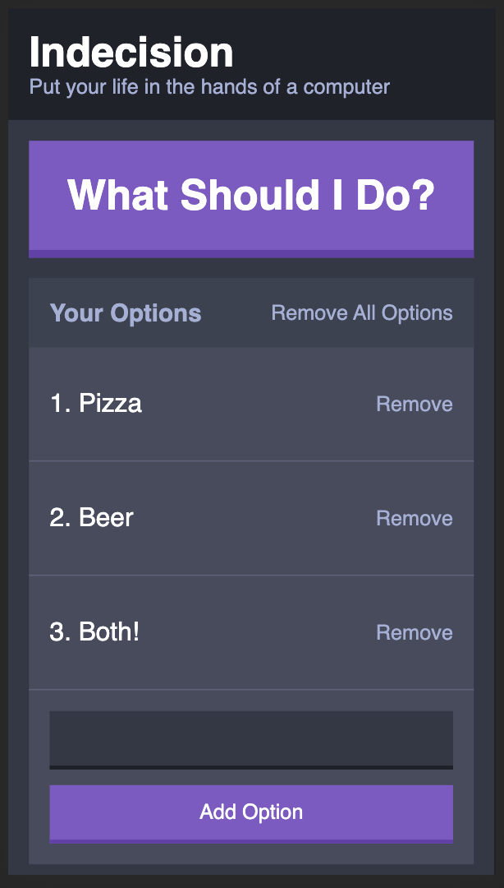
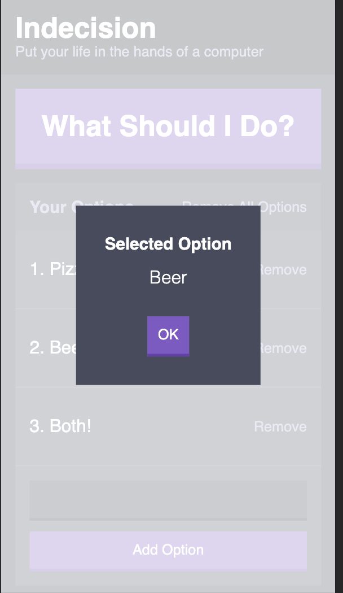

# Indecision App

This is part of [Andrew Mead](https://mead.io/)'s [The Complete React Developer Course](https://www.udemy.com/course/react-2nd-edition/). I acessed the course through Packt, so the course is not updated.

I am brushing up on using functional components since it's been a while since I've done much React.

The app itself is a modified TODO list. One adds their todos, and a random selection of the items suggests what to do, similar to the magic 8 ball.

Screenshots for the phone size:

The last section is writing your own Sass, which is the first time I've done that. I'm been using the same package versions he did, just so I don't get conflicts. There were compilation errors, which took a bit of searching. I had to upgrade node-sass to 4.12.

TODO:
Sass	ligthen (color.scale($light-blue, lightness: 10%)